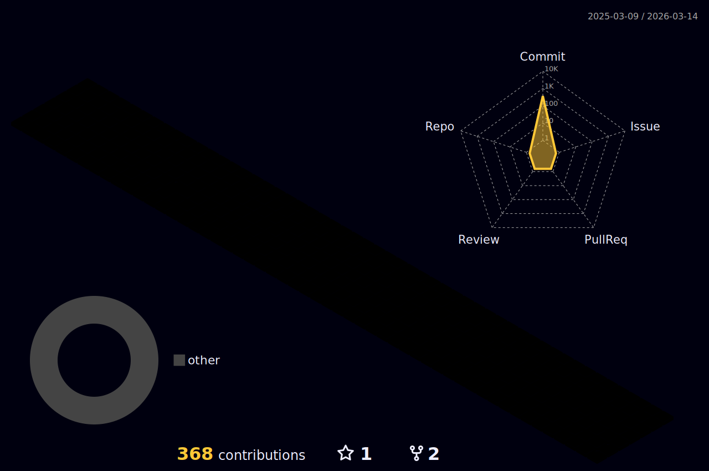

  
 
 

 

## :blue_book:**My Tech**:blue_book:

 
 

 
 
<svg role="img" viewBox="0 0 24 24" xmlns="http://www.w3.org/2000/svg"><title>Sass</title><path d="M12 0c6.627 0 12 5.373 12 12s-5.373 12-12 12S0 18.627 0 12 5.373 0 12 0zM9.615 15.998c.175.645.156 1.248-.024 1.792l-.065.18c-.024.061-.052.12-.078.176-.14.29-.326.56-.555.81-.698.759-1.672 1.047-2.09.805-.45-.262-.226-1.335.584-2.19.871-.918 2.12-1.509 2.12-1.509v-.003l.108-.061zm9.911-10.861c-.542-2.133-4.077-2.834-7.422-1.645-1.989.707-4.144 1.818-5.693 3.267C4.568 8.48 4.275 9.98 4.396 10.607c.427 2.211 3.457 3.657 4.703 4.73v.006c-.367.18-3.056 1.529-3.686 2.925-.675 1.47.105 2.521.615 2.655 1.575.436 3.195-.36 4.065-1.649.84-1.261.766-2.881.404-3.676.496-.135 1.08-.195 1.83-.104 2.101.24 2.521 1.56 2.43 2.1-.09.539-.523.854-.674.944-.15.091-.195.12-.181.181.015.09.091.09.21.075.165-.03 1.096-.45 1.141-1.471.045-1.29-1.186-2.729-3.375-2.7-.9.016-1.471.091-1.875.256-.03-.045-.061-.075-.105-.105-1.35-1.455-3.855-2.475-3.75-4.41.03-.705.285-2.564 4.8-4.814 3.705-1.846 6.661-1.335 7.171-.21.733 1.604-1.576 4.59-5.431 5.024-1.47.165-2.235-.404-2.431-.615-.209-.225-.239-.24-.314-.194-.12.06-.045.255 0 .375.12.3.585.825 1.396 1.095.704.225 2.43.359 4.5-.45 2.324-.899 4.139-3.405 3.614-5.505l.073.067z"/></svg>
 

 
 
 

## My github stats!:pencil2:

 
 

 

 

 
 
 

## Sns & profile:earth_asia:

 
 

 

 

 
 

## Trophy:trophy:

 
 

 

 
 

## Visit

 
 

 

 

 
  
